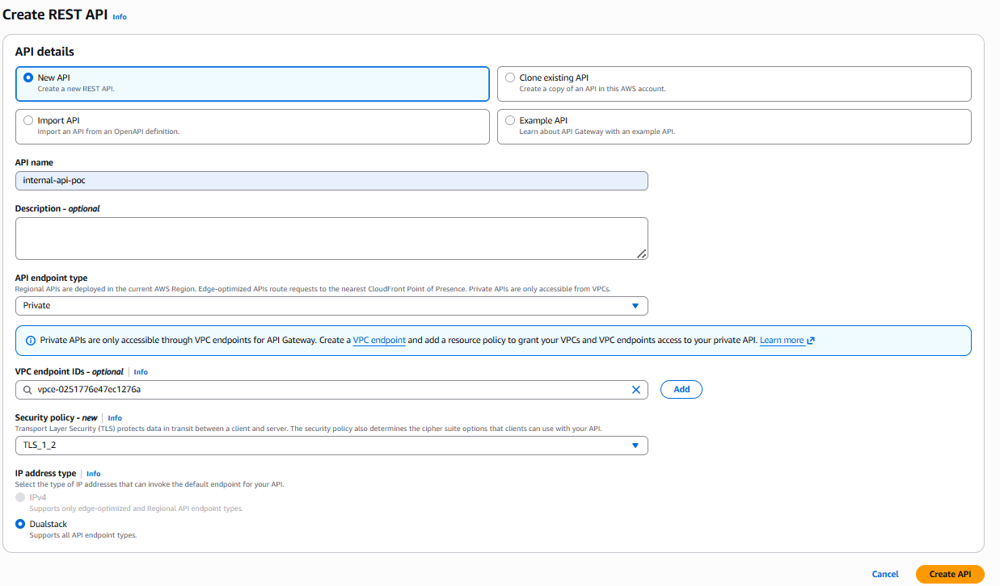
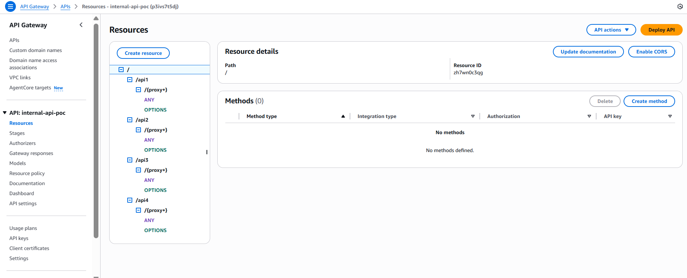
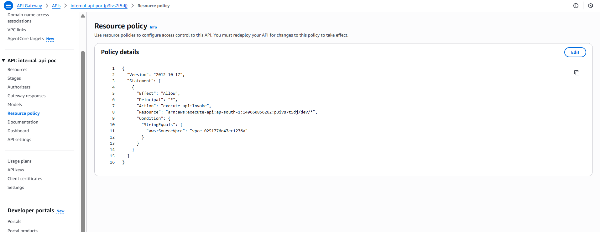
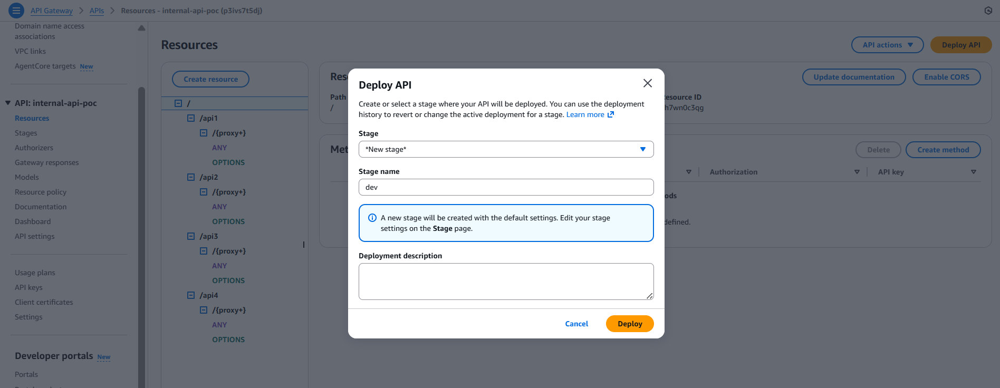
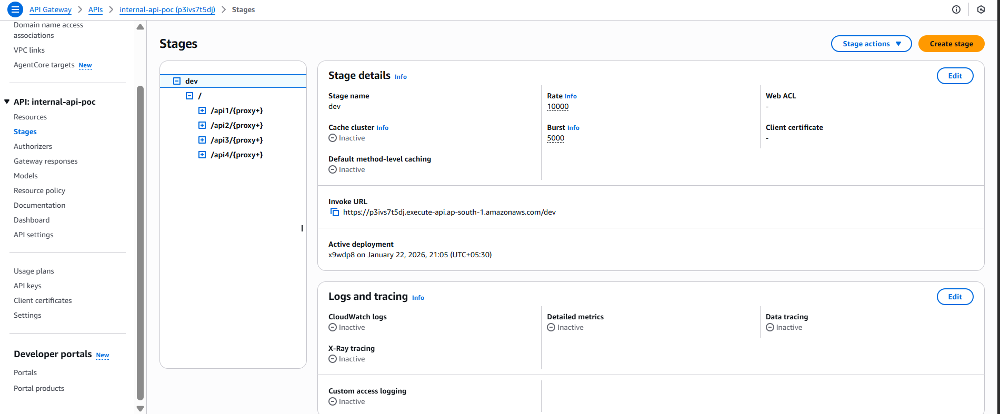
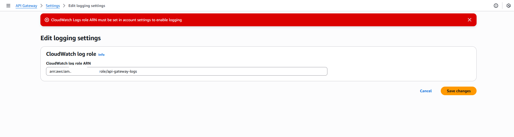
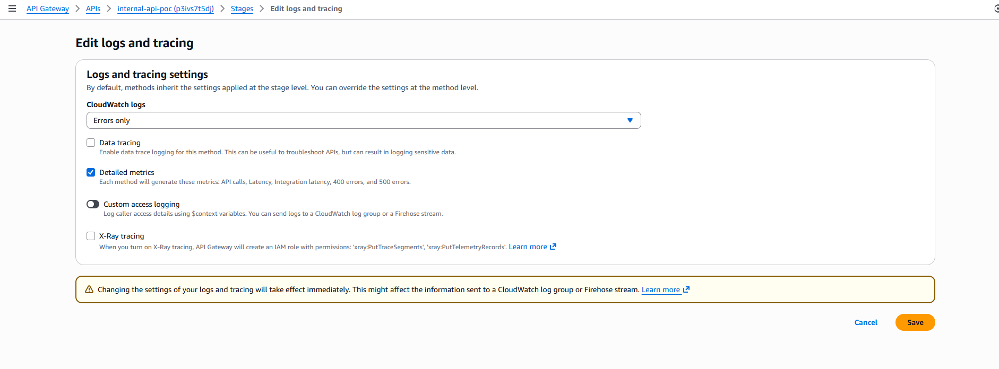
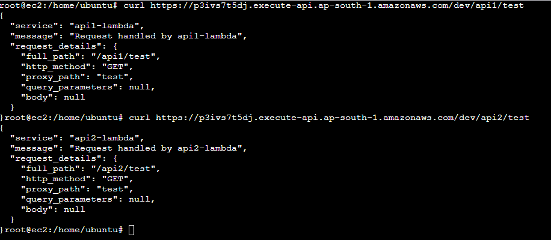
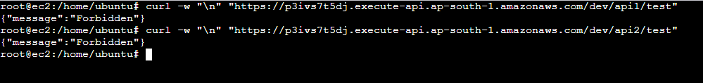

# Visual Implementation Guide (With Screenshots)

This guide walks through the complete implementation process with screenshots from actual AWS Console (January 2026).

---

## Image Reference

| Step | Image | Description |
|------|-------|-------------|
| 1 | `01-create-private-rest-api.png` | Creating the Private REST API |
| 2 | `02-api-resources-with-proxy.png` | Resource tree with proxy methods |
| 3 | `03-resource-policy-vpce.png` | Resource policy configuration |
| 4 | `04-deploy-api-new-stage.png` | Deploy API to new stage |
| 5 | `05-stage-details-after-deploy.png` | Stage details and invoke URL |
| 6 | `06-cloudwatch-log-role-arn.png` | CloudWatch log role setup |
| 7 | `07-stage-logging-settings.png` | Enable logging in stage |
| 8 | `08-test-success-no-apikey.png` | Test successful (no API key) |
| 9 | `09-redeploy-after-apikey-enabled.png` | Redeploy after enabling API keys |
| 10 | `10-test-forbidden-no-apikey.png` | 403 Forbidden without API key |
| 11 | `11-test-success-with-apikey.png` | Success with API key header |

---

## Step 1: Create Private REST API

**Navigation:** API Gateway Console → Create API → REST API → Build



**Configuration:**
| Field | Value | Notes |
|-------|-------|-------|
| API name | `internal-api-poc` | Your API identifier |
| Description | Optional | |
| API endpoint type | **Private** | Critical for internal APIs |
| VPC endpoint IDs | `vpce-xxxxxxxx` | Your VPC endpoint ID |
| Security policy | TLS 1.2 | Default is fine |
| IP address type | Dualstack | Default |

> ⚠️ **Important:** Select "Private" as endpoint type. This is what makes the API accessible only through VPC endpoints.

---

## Step 2: Create Resources with Proxy Method

**Navigation:** Your API → Resources → Create resource



**Resource Structure Created:**
```
/
├── /api1
│   └── /{proxy+}
│       ├── ANY
│       └── OPTIONS
├── /api2
│   └── /{proxy+}
│       ├── ANY
│       └── OPTIONS
├── /api3
│   └── /{proxy+}
│       ├── ANY
│       └── OPTIONS
└── /api4
    └── /{proxy+}
        ├── ANY
        └── OPTIONS
```

**Steps to create each resource:**

1. **Create `/api1` resource:**
   - Select root `/`
   - Click "Create resource"
   - Resource name: `api1`
   - Click "Create resource"

2. **Create `/{proxy+}` under `/api1`:**
   - Select `/api1`
   - Click "Create resource"
   - ✅ Enable "Proxy resource"
   - Resource name: `{proxy+}`
   - Click "Create resource"

3. **Configure ANY method:**
   - Select `/{proxy+}` → ANY
   - Integration type: Lambda function
   - ✅ Lambda proxy integration
   - Lambda function: `api1-lambda`
   - Save

4. Repeat for `/api2`, `/api3`, `/api4`

---

## Step 3: Configure Resource Policy

**Navigation:** Your API → Resource policy (left sidebar)



**Policy (Allow only from VPC Endpoint):**
```json
{
    "Version": "2012-10-17",
    "Statement": [
        {
            "Effect": "Allow",
            "Principal": "*",
            "Action": "execute-api:Invoke",
            "Resource": "arn:aws:execute-api:ap-south-1:ACCOUNT_ID:API_ID/*",
            "Condition": {
                "StringEquals": {
                    "aws:SourceVpce": "vpce-xxxxxxxxxxxx"
                }
            }
        }
    ]
}
```

> ⚠️ **Critical:** Use `aws:SourceVpce` NOT `aws:SourceVpc`. Private APIs route through VPC endpoint.

---

## Step 4: Deploy API to New Stage

**Navigation:** Click "Deploy API" button (top right)



**Configuration:**
| Field | Value |
|-------|-------|
| Stage | New stage |
| Stage name | `dev` |
| Deployment description | Optional |

> ℹ️ **Note:** A new stage will be created with default settings. Edit settings on the Stage page after deployment.

---

## Step 5: Stage Details After Deployment

**Navigation:** Your API → Stages → dev



**Key Information:**
| Field | Value |
|-------|-------|
| Stage name | dev |
| Rate (requests/sec) | 10000 (default) |
| Burst limit | 5000 (default) |
| Invoke URL | `https://p3iva7t5dj.execute-api.ap-south-1.amazonaws.com/dev` |
| Active deployment | Shows timestamp |

**Invoke URL Format:**
```
https://{api-id}.execute-api.{region}.amazonaws.com/{stage}
```

---

## Step 6: Configure CloudWatch Log Role

**Navigation:** API Gateway → Settings (left sidebar, bottom)



**Prerequisites:**
1. Create IAM role with trust policy for API Gateway
2. Attach `AmazonAPIGatewayPushToCloudWatchLogs` policy
3. Copy the Role ARN

**Configuration:**
- Enter Role ARN: `arn:aws:iam::ACCOUNT_ID:role/api-gateway-logs`
- Click "Save changes"

> ⚠️ **Warning banner:** If you see "CloudWatch Logs role ARN must be set in account settings to enable logging", you need to complete this step first.

---

## Step 7: Enable Logging in Stage

**Navigation:** Your API → Stages → dev → Logs and tracing → Edit



**Settings:**
| Option | Recommended | Description |
|--------|-------------|-------------|
| CloudWatch Logs | Errors only / Full | Start with "Errors only" |
| Data tracing | ⚠️ Disable in prod | Logs full request/response |
| Detailed metrics | ✅ Enable | Per-method metrics |
| Custom access logging | Optional | Custom log format |
| X-Ray tracing | ✅ Enable | Distributed tracing |

> ⚠️ **Warning:** Changes to logs and tracing take effect immediately. Data tracing can log sensitive data.

---

## Step 8: Test API (No API Key Required)

**From EC2 in VPC:**



```bash
# Test api1
curl https://p3iva7t5dj.execute-api.ap-south-1.amazonaws.com/dev/api1/test

# Test api2
curl https://p3iva7t5dj.execute-api.ap-south-1.amazonaws.com/dev/api2/test
```

**Response:**
```json
{
  "service": "api1-lambda",
  "message": "Request handled by api1-lambda",
  "request_details": {
    "full_path": "/api1/test",
    "http_method": "GET",
    "proxy_path": "test",
    "query_parameters": null,
    "body": null
  }
}
```

---

## Step 9: Enable API Key and Redeploy

**After enabling "API Key Required" on methods, you MUST redeploy:**


**Steps:**
1. Select method → Method Request → Edit
2. Set "API Key Required" = true
3. Click "Deploy API"
4. Select existing stage: `dev`
5. Click "Deploy"

> ⚠️ **Warning:** When you deploy to an existing stage, you immediately overwrite the current configuration.

---

## Step 10: Test Without API Key (403 Forbidden)



```bash
curl -w "\n" "https://p3iva7t5dj.execute-api.ap-south-1.amazonaws.com/dev/api1/test"
```

**Response:**
```json
{"message":"Forbidden"}
```

> ℹ️ **Remember:** API key enforcement requires:
> 1. API Key Required = true on method
> 2. Usage Plan created
> 3. API stage attached to Usage Plan
> 4. API Key associated with Usage Plan

---

## Step 11: Test With API Key Header (Success)


```bash
curl -H "x-api-key: Or80fpdmhQ71QPc9Yfs9lk..." \
  "https://p3iva7t5dj.execute-api.ap-south-1.amazonaws.com/dev/api1/test"
```

**Response:**
```json
{
  "service": "api1-lambda",
  "message": "Request handled by api1-lambda",
  "request_details": {
    "full_path": "/api1/test",
    "http_method": "GET",
    "proxy_path": "test",
    ...
  }
}
```

---

## Quick Reference: Complete Flow

```
1. Create Private REST API (endpoint type: Private)
           ↓
2. Create Resources (/api1, /api2, /{proxy+})
           ↓
3. Configure Lambda Integrations (proxy integration ✅)
           ↓
4. Add Resource Policy (aws:SourceVpce condition)
           ↓
5. Deploy API (create "dev" stage)
           ↓
6. Configure CloudWatch Logs (role ARN in settings)
           ↓
7. Enable Logging in Stage (stage → edit logs)
           ↓
8. Test from EC2 in VPC
           ↓
9. (Optional) Enable API Keys → Create Usage Plan → Redeploy
           ↓
10. Test with x-api-key header
```

---

**← Back to:** [05-hands-on-implementation.md](05-hands-on-implementation.md) | [00-overview.md](00-overview.md)
