# Kong Gateway Visual Implementation Guide

A comprehensive, screenshot-annotated walkthrough of configuring Kong Gateway to invoke AWS Lambda with API Key authentication.

**Based on Official Kong Documentation**

---

## Table of Contents

1. [Kong vs AWS API Gateway: Key Comparisons](#1-kong-vs-aws-api-gateway-key-comparisons)
2. [Architecture Overview](#2-architecture-overview)
3. [Step 1: Create Gateway Service](#3-step-1-create-gateway-service)
4. [Step 2: Create Route](#4-step-2-create-route)
5. [Step 3: Configure AWS Lambda Plugin](#5-step-3-configure-aws-lambda-plugin)
6. [Step 4: Create Consumer & Key Credential](#6-step-4-create-consumer--key-credential)
7. [Step 5: Configure CORS Plugin](#7-step-5-configure-cors-plugin)
8. [Step 6: Configure Key Auth Plugin](#8-step-6-configure-key-auth-plugin)
9. [Step 7: Testing the Integration](#9-step-7-testing-the-integration)
10. [Troubleshooting](#10-troubleshooting)

---

## 1. Kong vs AWS API Gateway: Key Comparisons

Coming from AWS API Gateway, you need to understand the key differences in timeout and payload limits:

### 1.1 Timeout Comparison

| Feature | AWS API Gateway | Kong Gateway | Notes |
|---------|-----------------|--------------|-------|
| **Integration Timeout** | **29 seconds** (hard limit, non-configurable for HTTP APIs) | **60 seconds** (default, fully configurable) | Kong wins: up to 24 hours possible |
| **Connect Timeout** | Built into 29s limit | Separate `connect_timeout` (default: 60000ms) | Kong allows granular control |
| **Read Timeout** | Built into 29s limit | Separate `read_timeout` (default: 60000ms) | Configurable per service |
| **Write Timeout** | N/A | Separate `write_timeout` (default: 60000ms) | Handles slow request uploads |
| **Lambda Plugin Timeout** | N/A | Separate `timeout` (default: 60000ms) | Independent of service timeout |

> [!IMPORTANT]
> **AWS API Gateway's 29-second limit is HARD-CODED for HTTP APIs.** As of June 2024, Regional REST APIs and Private REST APIs can request an increase beyond 29 seconds, but this requires quota approval. Kong Gateway has **no such limitation** - you can configure timeouts up to 24 hours.

### 1.2 Payload Size Comparison

| Feature | AWS API Gateway | Kong Gateway | Notes |
|---------|-----------------|--------------|-------|
| **Request Payload** | **10 MB** (WebSocket: 128 KB) | **No default limit** (`client_max_body_size=0`) | Kong wins: unlimited by default |
| **Response Payload** | **10 MB** (WebSocket: 128 KB) | **No default limit** | Configure via `nginx_proxy_client_max_body_size` |
| **Lambda Payload** | **6 MB** (synchronous), **256 KB** (async) | **Same Lambda limits apply** | Lambda limit, not gateway limit |
| **Request Size Plugin** | N/A | Available: default 128 MB | Optional enforcement |
| **Body Buffer** | N/A | `client_body_buffer_size` (default: 8KB) | Threshold for disk buffering |

> [!TIP]
> While Kong has no default limits, your actual limit will be the **Lambda service limit** of 6 MB for synchronous invocations. Kong's `skip_large_bodies` option (in the Lambda plugin) helps handle this gracefully.

### 1.3 Feature Comparison Summary

| Feature | AWS API Gateway | Kong Gateway |
|---------|-----------------|--------------|
| **Max Timeout** | 29 seconds | Configurable (up to 24 hours) |
| **Max Payload** | 10 MB | Unlimited (configure as needed) |
| **Retry Logic** | Automatic for 5xx | Configurable `retries` parameter |
| **Timeout Retry Behavior** | Limited | Different for idempotent/non-idempotent methods |
| **Price Model** | Per request + data transfer | Self-hosted (infrastructure cost only) |

---

## 2. Architecture Overview

Before diving into the configuration, understand the flow:

```
┌─────────────┐     ┌─────────────┐     ┌─────────────┐     ┌─────────────┐     ┌─────────────┐
│   Browser   │────▶│     ALB     │────▶│    Nginx    │────▶│    Kong     │────▶│   Lambda    │
│  (UI App)   │◀────│  (AWS LB)   │◀────│  (Reverse   │◀────│  (Gateway)  │◀────│  (Function) │
│             │     │             │     │   Proxy)    │     │             │     │             │
└─────────────┘     └─────────────┘     └─────────────┘     └─────────────┘     └─────────────┘
      │                   │                   │                   │                   │
      │   HTTP Request    │   Forward to      │   Strip prefix    │   Invoke via      │
      │   with x-api-key  │   EC2:80          │   /api-gateway    │   AWS SDK         │
      │                   │                   │                   │                   │
```

**Key Components Being Configured:**
| Component | Purpose | Official Docs |
|-----------|---------|---------------|
| Gateway Service | Abstract definition of your backend (placeholder for Lambda) | [Service Entity](https://developer.konghq.com/gateway/entities/service/) |
| Route | URL paths that trigger this service (`/users`, `/config`, `/orders`) | [Route Entity](https://developer.konghq.com/gateway/entities/route/) |
| AWS Lambda Plugin | Enables direct Lambda invocation instead of HTTP proxying | [AWS Lambda Plugin](https://developer.konghq.com/plugins/aws-lambda/reference/) |
| Consumer | Identity entity that holds API key credentials | [Consumer Entity](https://developer.konghq.com/gateway/entities/consumer/) |
| CORS Plugin | Handles browser cross-origin requests | [CORS Plugin](https://developer.konghq.com/plugins/cors/reference/) |
| Key Auth Plugin | Enforces API key validation on incoming requests | [Key Auth Plugin](https://developer.konghq.com/plugins/key-auth/reference/) |

---

## 3. Step 1: Create Gateway Service

A Gateway Service represents the upstream service in your system. It's the business logic component responsible for processing requests. Even though we use the Lambda plugin (which bypasses HTTP proxying), Kong requires a Service to attach Routes and Plugins.

### 3.1 Navigate to Gateway Services

Navigate to **Gateway Services** → **+ New Gateway Service**.

### 3.2 General Information

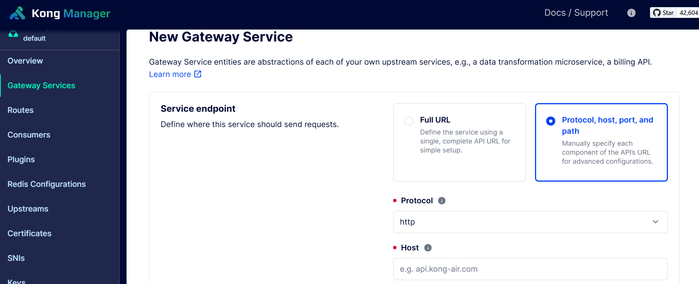

#### Complete Service Configuration Reference

| Field | Type | Default | Your Value | Description |
|-------|------|---------|------------|-------------|
| **name** | string | *auto-generated* | `poc-lambda-service` | Human-readable identifier. Use descriptive names like `user-api-service`. |
| **protocol** | enum | `http` | `http` | Protocol for upstream: `grpc`, `grpcs`, `http`, `https`, `tcp`, `tls`, `tls_passthrough`, `udp`, `ws`, `wss`. For Lambda plugin, this is just a placeholder. |
| **host** | string | *required* | `localhost` | Host of the upstream server. **Placeholder** when using Lambda plugin. |
| **port** | integer | `80` | `80` | Port of the upstream server. Range: 0-65535. |
| **path** | string | `null` | *empty* | Path prepended to requests. Not needed for Lambda. |

> [!NOTE]
> **Why `localhost` and `80`?** These are placeholders. When the AWS Lambda plugin is attached, Kong bypasses normal HTTP routing and invokes Lambda directly via the AWS SDK. The service host/port are never actually used.

### 3.3 Timeout Configuration (Critical for Long-Running Lambdas)

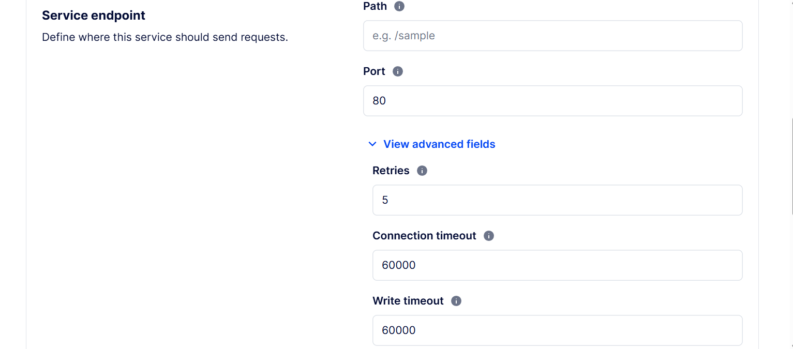

| Field | Type | Default | Recommended | Description |
|-------|------|---------|-------------|-------------|
| **retries** | integer | `5` | `3-5` | Number of retry attempts on connection failures. Too many retries can cause cascading timeouts. |
| **connect_timeout** | integer | `60000` | `10000` | Milliseconds to establish TCP connection. Returns `502 Bad Gateway` if exceeded. |
| **write_timeout** | integer | `60000` | `60000` | Idle time between successive write operations. Returns `504 Gateway Time-out`. |
| **read_timeout** | integer | `60000` | `60000-120000` | Time to wait for upstream response. **Set this higher than your Lambda's max execution time.** |

> [!WARNING]
> **Timeout Hierarchy Matters!**
> ```
> ┌─────────────────────────────────────────────────────────────────┐
> │  client_read_timeout (Nginx) ≥ read_timeout (Service)          │
> │       ≥ timeout (Lambda Plugin) ≥ Lambda Max Execution Time    │
> └─────────────────────────────────────────────────────────────────┘
> ```
> If Lambda takes 30s but `read_timeout` is 10s, Kong returns 504 before Lambda responds.

#### Retry Behavior by HTTP Method

| Method Type | Methods | Retry on Timeout? |
|-------------|---------|-------------------|
| **Idempotent** | GET, HEAD, PUT, DELETE, OPTIONS, TRACE | ✅ Yes (up to `retries` count) |
| **Non-Idempotent** | POST, PATCH, LOCK, UNLOCK, PROPPATCH, MKCOL, MOVE, COPY | ❌ No (unless `proxy_next_upstream non_idempotent` set) |

### 3.4 Service Name

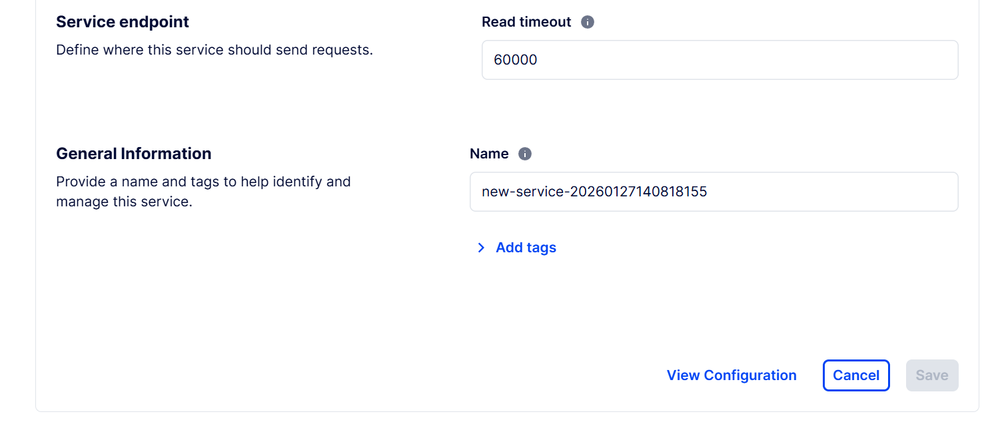

**Best Practice:** Use meaningful names like:
- `user-service` - for user management APIs
- `order-service` - for order processing
- `poc-lambda-service` - for POC/testing

Click **Save** to create the Gateway Service.

---

## 4. Step 2: Create Route

Routes match incoming requests using URL patterns and HTTP verbs, then pass them to a Gateway Service. This determines which upstream service processes a request.

### 4.1 Navigate to Routes

Go to **Routes** → **+ Create Route**.

### 4.2 General Information

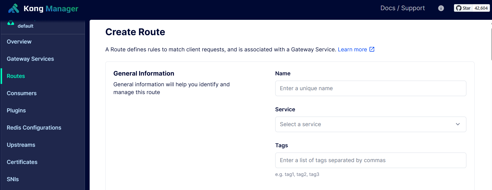

| Field | Type | Default | Your Value | Description |
|-------|------|---------|------------|-------------|
| **name** | string | *auto-generated* | `poc-main-route` | Unique identifier for the route |
| **service** | object | *required* | `poc-lambda-service` | The Service this Route is associated with |
| **tags** | array | `null` | *optional* | Tags for grouping and filtering |

### 4.3 Routing Criteria

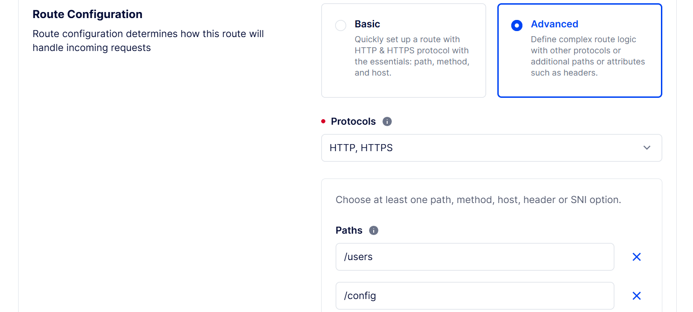

| Field | Type | Default | Your Value | Description |
|-------|------|---------|------------|-------------|
| **protocols** | array | `["http", "https"]` | `["http", "https"]` | Protocols this Route accepts. Options: `grpc`, `grpcs`, `http`, `https`, `tcp`, `tls`, `tls_passthrough`, `udp`, `ws`, `wss` |
| **hosts** | array | `null` | *empty* | Domain names that match this Route. Empty = match all hosts. |
| **methods** | array | `null` | *empty* | HTTP methods that match (GET, POST, etc.). Empty = match all methods. |

### 4.4 Path Configuration

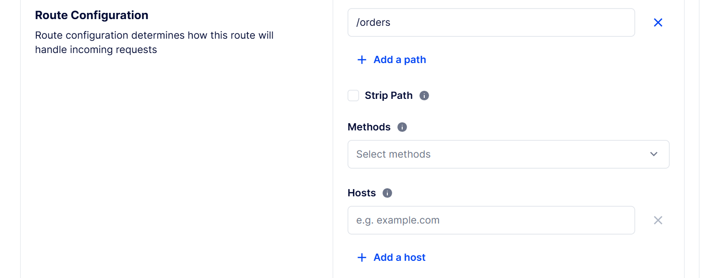

| Field | Type | Default | Your Value | Description |
|-------|------|---------|------------|-------------|
| **paths** | array | `null` | `["/users", "/config", "/orders", "/health", "/"]` | URL paths that match this Route. Supports regex with `~` prefix. |

> [!TIP]
> **Path Matching Rules:**
> - Exact: `/users` matches `/users` and `/users/123`
> - Regex: `~/users/\d+$` matches `/users/123` but not `/users/abc`
> - The more specific path wins when multiple Routes match

### 4.5 Route Behavior (Critical Settings)

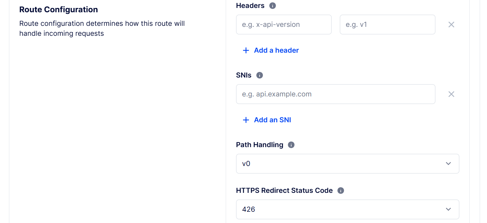

| Field | Type | Default | Recommended | Description |
|-------|------|---------|-------------|-------------|
| **strip_path** | boolean | `true` | **`false`** | If `true`, removes matched path from upstream request. **Set to `false` so Lambda sees `/users` not `/`.** |
| **preserve_host** | boolean | `false` | `false` | If `true`, sends original Host header to upstream. |
| **path_handling** | enum | `v0` | `v0` | How paths are constructed: `v0` (legacy) or `v1` (normalized). |

> [!CAUTION]
> **`strip_path = false` is CRITICAL for Lambda routing!**
> 
> | strip_path | Request | Lambda Receives |
> |------------|---------|-----------------|
> | `true` | `/users/123` | `/123` (path stripped!) |
> | `false` | `/users/123` | `/users/123` (path preserved) |
> 
> Your Lambda needs the full path to determine which action to perform!

### 4.6 Advanced Options


| Field | Type | Default | Description |
|-------|------|---------|-------------|
| **regex_priority** | integer | `0` | Priority for regex route matching (higher = checked first) |
| **https_redirect_status_code** | integer | `426` | HTTP status for HTTPS redirect (301, 302, 307, 308, 426) |
| **request_buffering** | boolean | `true` | Buffer entire request before proxying |
| **response_buffering** | boolean | `true` | Buffer entire response before returning |
| **headers** | object | `null` | Header key-value pairs that must match |
| **snis** | array | `null` | Server Name Indication values for TLS routing |

Click **Save** to create the Route.

---

## 5. Step 3: Configure AWS Lambda Plugin

The AWS Lambda plugin enables Kong Gateway to invoke Lambda functions directly via the AWS SDK, bypassing traditional HTTP proxying.

### 5.1 Navigate to Plugin Installation

Go to **Plugins** → **+ New Plugin** → Search for `aws-lambda` → Click **Enable**.

### 5.2 Plugin Scope

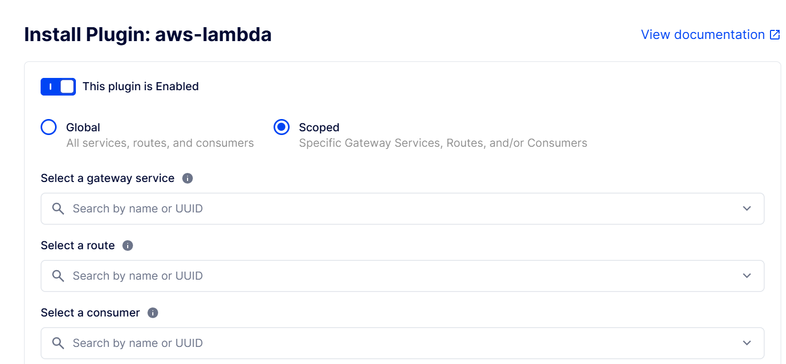

| Field | Type | Options | Your Value | Description |
|-------|------|---------|------------|-------------|
| **enabled** | boolean | `true`/`false` | `true` | Enable or disable this plugin |
| **scope** | enum | `global`, `scoped` | `scoped` | **Scoped** = apply to specific routes/services only |
| **service** | object | - | `poc-lambda-service` | Apply to this service (optional if route specified) |
| **route** | object | - | `poc-main-route` | Apply to this route (recommended) |
| **consumer** | object | - | *empty* | Leave empty to apply to ALL consumers |

> [!NOTE]
> **Why scope to Route, not Consumer?** The Lambda plugin defines WHAT happens (invoke Lambda). Authentication (WHO can access) is handled by Key Auth plugin. Keeping them separate follows the single-responsibility principle.

### 5.3 Protocol Configuration

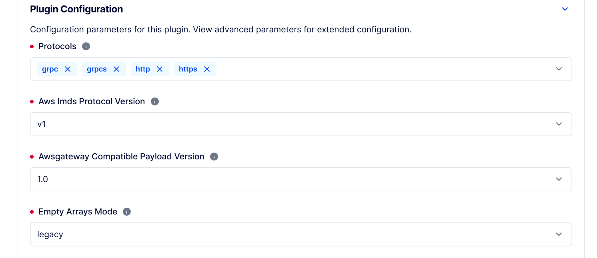

| Field | Type | Default | Description |
|-------|------|---------|-------------|
| **protocols** | array | `["grpc", "grpcs", "http", "https"]` | Protocols this plugin applies to |
| **aws_imds_protocol_version** | enum | `v1` | EC2 Instance Metadata Service version. Use `v2` for IMDSv2 (more secure). |
| **awsgateway_compatible** | boolean | `false` | Wrap request in AWS API Gateway format |
| **awsgateway_compatible_payload_version** | enum | `1.0` | API Gateway payload version (`1.0` or `2.0`) |

### 5.4 Invocation Settings

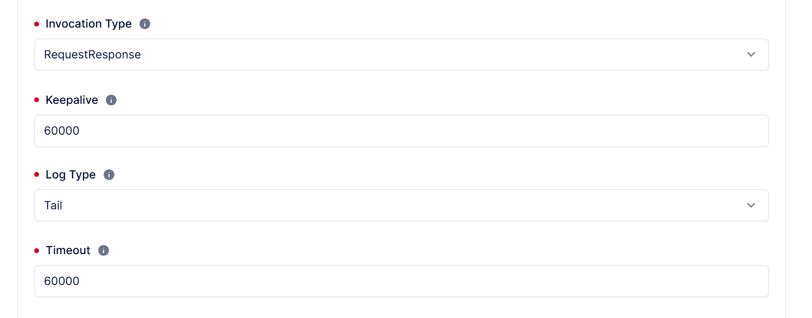

| Field | Type | Default | Recommended | Description |
|-------|------|---------|-------------|-------------|
| **invocation_type** | enum | `RequestResponse` | `RequestResponse` | **RequestResponse** = synchronous (wait for response), **Event** = async (fire and forget), **DryRun** = validate only |
| **keepalive** | integer | `60000` | `60000` | Keep connection to AWS Lambda alive for reuse (ms) |
| **log_type** | enum | `Tail` | `Tail` | **Tail** = include last 4KB of Lambda logs in response, **None** = no logs |
| **timeout** | integer | `60000` | `60000-300000` | Timeout for Lambda invocation in milliseconds |

> [!IMPORTANT]
> **Timeout Recommendation for Different Workloads:**
> | Workload Type | Lambda Timeout | Plugin Timeout | Service read_timeout |
> |---------------|----------------|----------------|---------------------|
> | Quick APIs | 3-10s | 15000 | 20000 |
> | Standard APIs | 10-30s | 45000 | 60000 |
> | Heavy Processing | 30-60s | 75000 | 90000 |
> | AI/ML Inference | 60-300s | 310000 | 330000 |

### 5.5 AWS Authentication

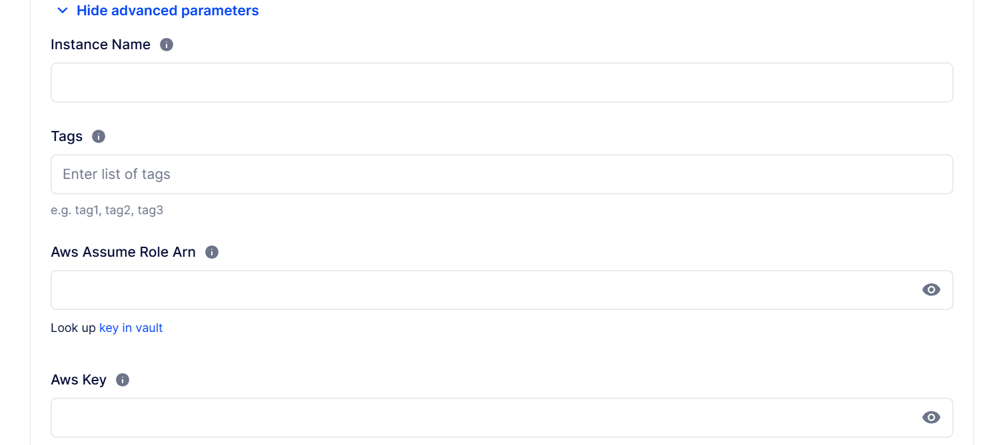

| Field | Type | Default | Recommended | Description |
|-------|------|---------|-------------|-------------|
| **aws_assume_role_arn** | string | `null` | *empty* | ARN of IAM role to assume (for cross-account) |
| **aws_key** | string | `null` | **`null` (empty)** | AWS access key. **Leave empty to use EC2 IAM role!** |
| **aws_secret** | string | `null` | **`null` (empty)** | AWS secret key. **Leave empty to use EC2 IAM role!** |
| **aws_role_session_name** | string | `kong` | `kong` | Session name for CloudTrail audit logging |
| **aws_sts_endpoint_url** | string | `null` | *empty* | Custom STS endpoint URL |

> [!CAUTION]
> **NEVER hardcode AWS credentials in Kong!**
> 
> ✅ **Correct**: Leave `aws_key` and `aws_secret` empty. Kong will automatically use the EC2 instance's IAM role via IMDS (Instance Metadata Service).
> 
> ❌ **Wrong**: Putting actual access keys in these fields exposes credentials in Kong's configuration.

### 5.6 Lambda Function Settings

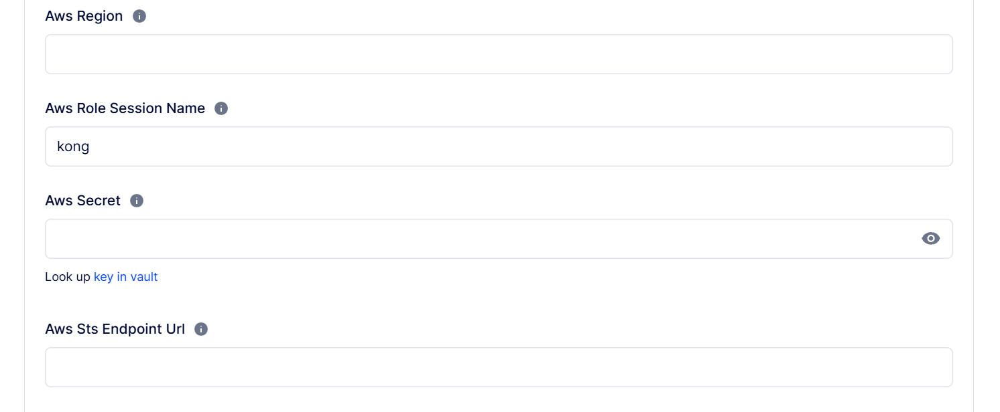
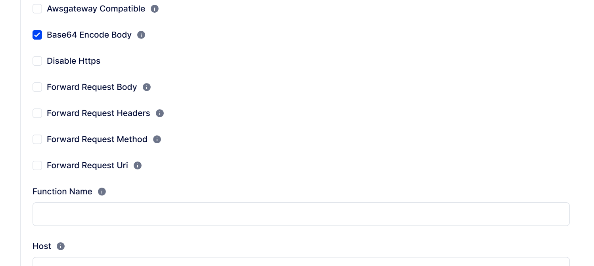

| Field | Type | Default | Your Value | Description |
|-------|------|---------|------------|-------------|
| **function_name** | string | *required* | `kong-poc-lambda` | Lambda function name or ARN. Can be full ARN, partial ARN, or just the function name. |
| **aws_region** | string | `null` | `ap-south-1` | AWS region where Lambda resides. If not set, reads from `AWS_REGION` or `AWS_DEFAULT_REGION` env vars. |
| **qualifier** | string | `null` | *empty* | Lambda version/alias (e.g., `$LATEST`, `prod`, `v2`). Empty = default alias. |
| **host** | string | `null` | *empty* | Custom Lambda endpoint (for LocalStack, etc.) |
| **port** | integer | `443` | `443` | Port for Lambda service (always 443 for AWS) |
| **disable_https** | boolean | `false` | `false` | Use HTTP instead of HTTPS (only for local testing) |

> [!TIP]
> **Function Name Formats:**
> - Just name: `my-function`
> - Partial ARN: `123456789012:function:my-function`
> - Full ARN: `arn:aws:lambda:ap-south-1:123456789012:function:my-function`
> - With alias: `arn:aws:lambda:ap-south-1:123456789012:function:my-function:prod`

### 5.7 Request Forwarding Options

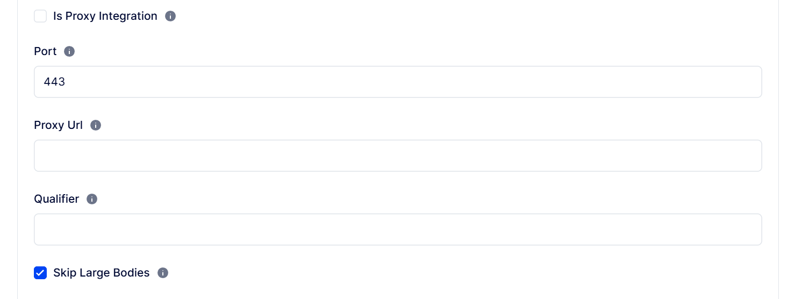

| Field | Type | Default | Recommended | Description |
|-------|------|---------|-------------|-------------|
| **forward_request_body** | boolean | `false` | `true` | Include request body in `request_body` field of Lambda event |
| **forward_request_headers** | boolean | `false` | `true` | Include request headers in `request_headers` field |
| **forward_request_method** | boolean | `false` | `true` | Include HTTP method in `request_method` field |
| **forward_request_uri** | boolean | `false` | `true` | Include URI path in `request_uri` field |
| **base64_encode_body** | boolean | `true` | `true` | Base64 encode the request body (required for binary data) |
| **skip_large_bodies** | boolean | `false` | `true` | Skip sending body if it exceeds Lambda's 6MB limit |

> [!NOTE]
> **What Lambda Receives (when all `forward_request_*` options are `true`):**
> ```json
> {
>   "request_method": "POST",
>   "request_uri": "/users/123",
>   "request_headers": {
>     "content-type": "application/json",
>     "x-custom-header": "value"
>   },
>   "request_body": "{\"name\": \"John\"}",
>   "request_body_args": {
>     "name": "John"
>   }
> }
> ```

### 5.8 Response Handling

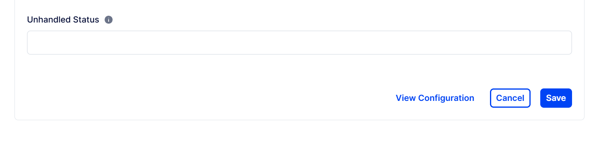

| Field | Type | Default | Recommended | Description |
|-------|------|---------|-------------|-------------|
| **is_proxy_integration** | boolean | `false` | `true` | Parse Lambda response as API Gateway proxy format (with statusCode, headers, body) |
| **unhandled_status** | integer | `null` | `502` | HTTP status to return on Lambda error (null = 500) |
| **proxy_url** | string | `null` | *empty* | HTTP proxy URL for Lambda calls (for VPC setups) |

> [!IMPORTANT]
> **`is_proxy_integration = true` for Full Control!**
> 
> When enabled, your Lambda must return this format:
> ```json
> {
>   "statusCode": 200,
>   "headers": {
>     "Content-Type": "application/json"
>   },
>   "body": "{\"users\": [...]}"
> }
> ```
> Kong will use these values for the actual HTTP response to the client.

Click **Save** to enable the AWS Lambda plugin.

---

## 6. Step 4: Create Consumer & Key Credential

A Consumer is an entity that identifies an external client that consumes your APIs. Think of it as "who is calling your API" - it could be an application, a service, or a user.

### 6.1 Navigate to Consumers

Go to **Consumers** → **+ New Consumer**.

### 6.2 Consumer Identification

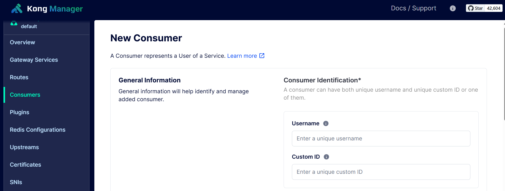
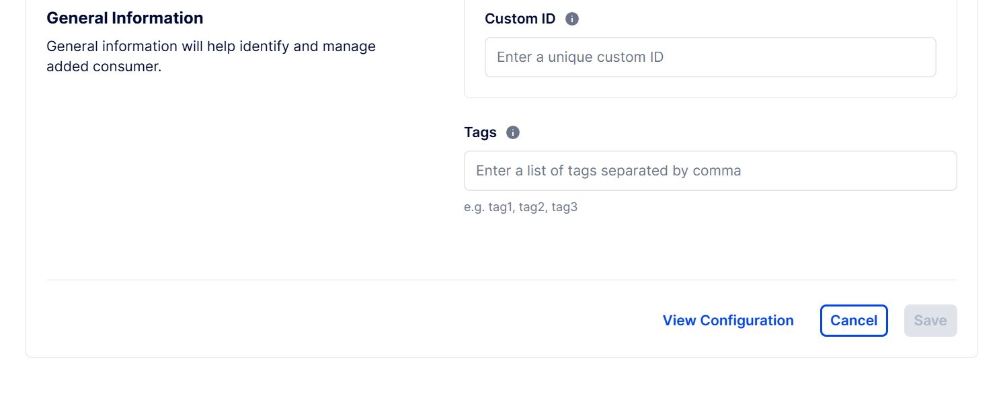

| Field | Type | Required | Your Value | Description |
|-------|------|----------|------------|-------------|
| **username** | string | ✓ (one of username/custom_id) | `frontend-app` | Unique username for the Consumer |
| **custom_id** | string | ✓ (one of username/custom_id) | *empty* | Custom identifier from your system (e.g., user ID from your database) |
| **tags** | array | ✗ | *empty* | Tags for filtering and organization |

> [!NOTE]
> **Consumer Use Cases:**
> | Use Case | Username Example | Description |
> |----------|------------------|-------------|
> | Frontend App | `web-frontend` | Your React/Angular/Vue app |
> | Mobile App | `mobile-ios-app` | iOS or Android client |
> | Partner | `partner-company-x` | Third-party integrations |
> | Internal Service | `order-processing-service` | Microservice-to-microservice |

Click **Save** to create the Consumer.

### 6.3 Create API Key Credential

After creating the Consumer, navigate to its detail page:
**Consumers** → Click `frontend-app` → **Credentials** tab → **Key Authentication** → **+ New Key Auth Credential**

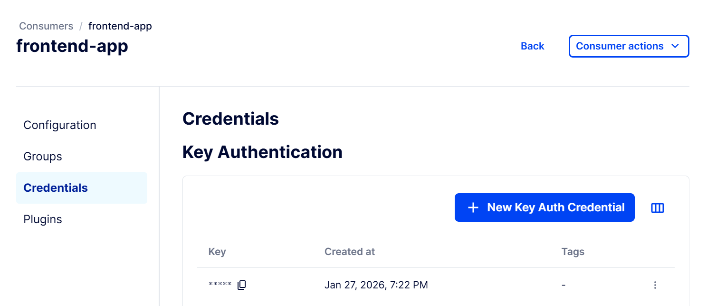

This shows the Credentials page with an existing key (masked as `•••••`).

### 6.4 Key Credential Form

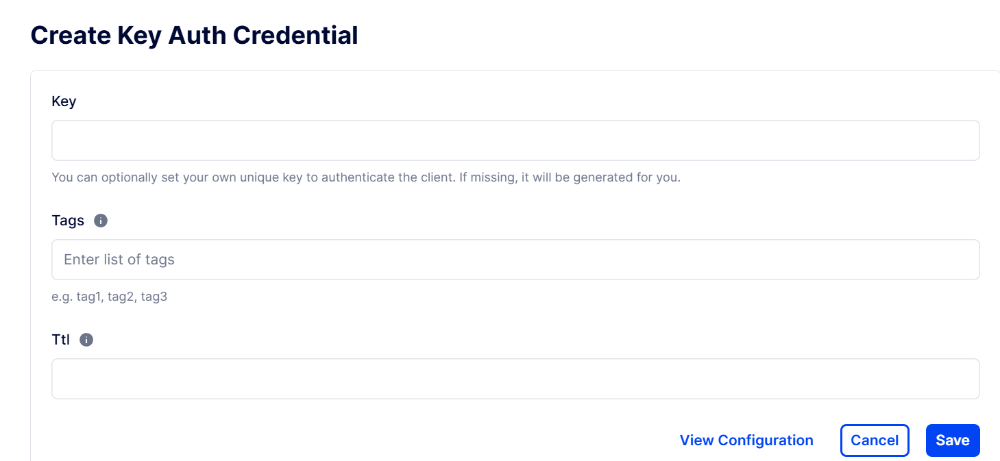

| Field | Type | Default | Your Value | Description |
|-------|------|---------|------------|-------------|
| **key** | string | *auto-generated* | `s3K5mGfjHN08hCJwlxxvY99PIH6lgfOe` | The API key value. Leave empty for auto-generation (recommended for security). |
| **tags** | array | `null` | *empty* | Tags for filtering |
| **ttl** | integer | `null` | *empty* | Time-to-live in seconds. `null` = never expires. Set for rotating keys. |

> [!CAUTION]
> **Copy the key immediately after creation!** If auto-generated, you can only see it once. Kong stores keys as hashes for security.

**Recommended TTL Values:**
| Environment | TTL | Description |
|-------------|-----|-------------|
| Development | 86400 (1 day) | Quick rotation for testing |
| Staging | 604800 (7 days) | Weekly rotation |
| Production | 2592000 (30 days) | Monthly rotation with alerts |
| Long-lived | `null` | No expiration (use with caution) |

Click **Save** to create the credential.

---

## 7. Step 5: Configure CORS Plugin

The CORS plugin adds Cross-Origin Resource Sharing headers, enabling browsers to make cross-origin requests to your API.

### 7.1 Navigate to CORS Plugin

Go to **Plugins** → **+ New Plugin** → Search for `cors` → Click **Enable**.

### 7.2 Plugin Scope

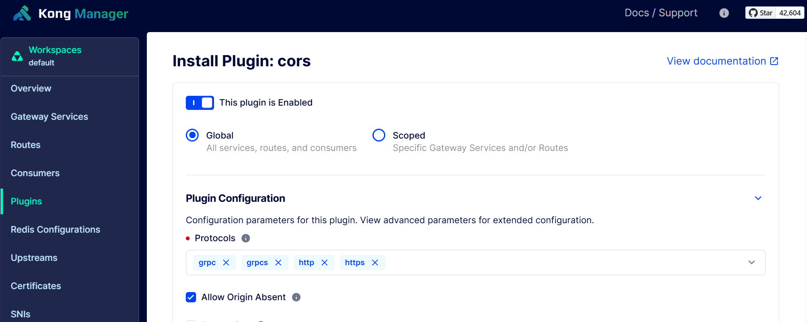

| Field | Type | Default | Recommended | Description |
|-------|------|---------|-------------|-------------|
| **enabled** | boolean | `true` | `true` | Enable/disable the plugin |
| **scope** | enum | - | `global` | Apply globally for consistent CORS across all APIs |
| **protocols** | array | all | `["http", "https"]` | Protocols to apply CORS to |

### 7.3 CORS Configuration

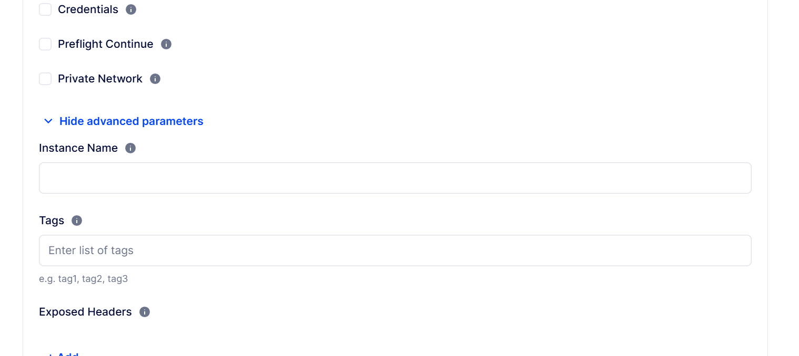
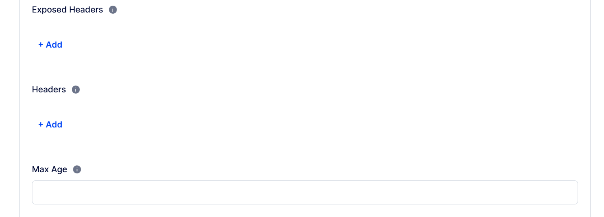
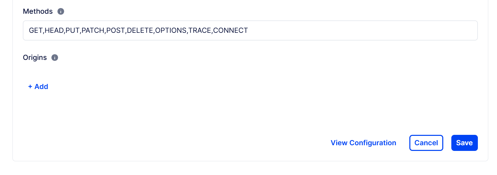

#### Complete CORS Configuration Reference

| Field | Type | Default | Recommended | Description |
|-------|------|---------|-------------|-------------|
| **origins** | array | `null` | `["*"]` or specific domains | Allowed origins for `Access-Control-Allow-Origin`. Use `*` for dev, specific domains for prod. Supports regex. |
| **methods** | array | all methods | `["GET", "POST", "PUT", "DELETE", "PATCH", "OPTIONS"]` | Allowed HTTP methods |
| **headers** | array | all headers | `["Content-Type", "Authorization", "x-api-key"]` | Allowed request headers |
| **exposed_headers** | array | `null` | `["X-Request-Id"]` | Headers browsers can access via JavaScript |
| **credentials** | boolean | `false` | `true` if using cookies | Send `Access-Control-Allow-Credentials: true` |
| **max_age** | integer | `null` | `86400` | Seconds to cache preflight (24 hours recommended) |
| **preflight_continue** | boolean | `false` | `false` | Pass OPTIONS to upstream (false = Kong handles) |
| **private_network** | boolean | `false` | `false` | Support Private Network Access requests |

> [!TIP]
> **CORS Configuration by Environment:**
> 
> | Environment | Origins | Credentials | Recommendation |
> |-------------|---------|-------------|----------------|
> | Development | `*` | `false` | Allow all for testing |
> | Staging | `["https://staging.example.com"]` | `true` | Match staging domains |
> | Production | `["https://app.example.com", "https://www.example.com"]` | `true` | Whitelist only |

> [!WARNING]
> **Never use `origins: ["*"]` with `credentials: true` in production!** This is a security vulnerability. Browsers will reject this combination anyway.

Click **Save** to enable the CORS plugin.

---

## 8. Step 6: Configure Key Auth Plugin

The Key Authentication plugin enforces API key validation. Without it, anyone can access your APIs even if you've created Consumers with keys.

### 8.1 Navigate to Key Auth Plugin

Go to **Plugins** → **+ New Plugin** → Search for `key-auth` → Click **Enable**.

### 8.2 Plugin Scope

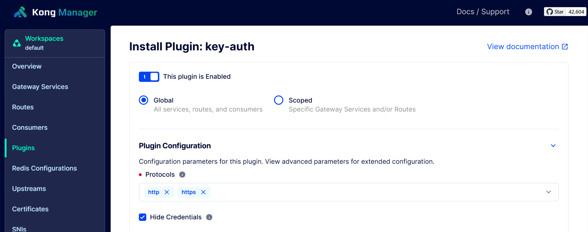

| Field | Type | Default | Recommended | Description |
|-------|------|---------|-------------|-------------|
| **enabled** | boolean | `true` | `true` | Enable/disable authentication |
| **scope** | enum | - | `global` or `scoped` | Global = all routes, Scoped = specific routes |
| **protocols** | array | `["grpc", "grpcs", "http", "https"]` | `["http", "https"]` | Protocols requiring authentication |

### 8.3 Key Location Configuration

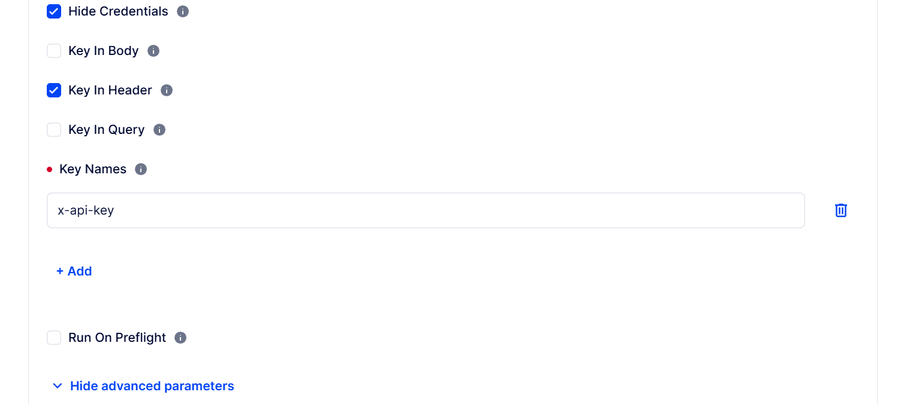

| Field | Type | Default | Recommended | Description |
|-------|------|---------|-------------|-------------|
| **key_names** | array | `["apikey"]` | `["x-api-key"]` | Header/query/body field names to look for the key |
| **key_in_header** | boolean | `true` | `true` | Look for key in request headers |
| **key_in_query** | boolean | `true` | `false` | Look for key in query string. **Disable for security!** |
| **key_in_body** | boolean | `false` | `false` | Look for key in request body |
| **hide_credentials** | boolean | `false` | `true` | Remove the key before forwarding to upstream |

> [!CAUTION]
> **Security: Disable `key_in_query`!**
> 
> Query parameters appear in:
> - Browser URL bar (visible to users)
> - Server access logs
> - Browser history
> - Referrer headers
> 
> Always prefer headers: `x-api-key: your-secret-key`

### 8.4 Advanced Options

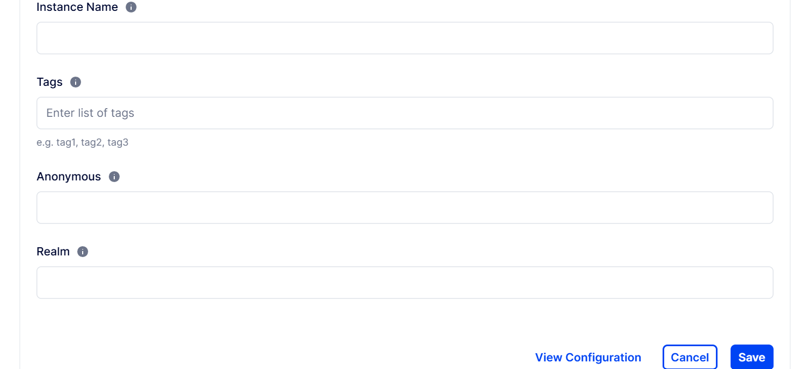

| Field | Type | Default | Description |
|-------|------|---------|-------------|
| **run_on_preflight** | boolean | `true` | Require key for OPTIONS requests. Set `false` for browser CORS preflight. |
| **anonymous** | string | `null` | Consumer ID to use if no key provided (enables anonymous access) |
| **realm** | string | `null` | Realm value for `WWW-Authenticate` header on 401 |

> [!IMPORTANT]
> **Set `run_on_preflight: false`** when using CORS with browsers!
> 
> CORS preflight requests (OPTIONS) can't include custom headers like `x-api-key`. If `run_on_preflight` is `true`, browsers get 401 errors before the actual request.

Click **Save** to enable the Key Auth plugin.

---

## 9. Step 7: Testing the Integration

### 9.1 Test WITHOUT API Key (Should Fail)

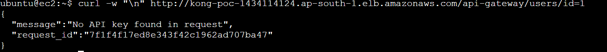

**Command:**
```bash
curl -w "\n" "http://kong-poc-1434114124.ap-south-1.elb.amazonaws.com/api-gateway/users/id=1"
```

**Response:**
```json
{
  "message": "No API key found in request",
  "request_id": "7f1f4f17ed8e343f42c1962ad707ba47"
}
```

**What happened:**
1. ✅ Request reached Kong via ALB → Nginx
2. ✅ Key Auth Plugin checked for `x-api-key` header
3. ❌ No key found → **401 Unauthorized** returned
4. ⛔ Lambda was **never invoked** (auth failed before reaching Lambda plugin)

### 9.2 Test WITH API Key (Should Succeed)

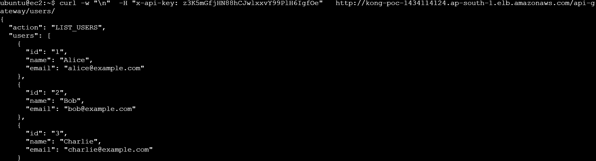

**Command:**
```bash
curl -w "\n" -H "x-api-key: s3K5mGfjHN08hCJwlxxvY99PIH6lgfOe" \
  "http://kong-poc-1434114124.ap-south-1.elb.amazonaws.com/api-gateway/users/"
```

**Response:**
```json
{
  "action": "LIST_USERS",
  "users": [
    {"id": "1", "name": "Alice", "email": "alice@example.com"},
    {"id": "2", "name": "Bob", "email": "bob@example.com"},
    {"id": "3", "name": "Charlie", "email": "charlie@example.com"}
  ]
}
```

**What happened:**
1. ✅ Request reached Kong via ALB → Nginx
2. ✅ Key Auth Plugin found `x-api-key` header
3. ✅ Key validated against Consumer `frontend-app` → **Access Granted**
4. ✅ CORS headers added (if applicable)
5. ✅ Lambda Plugin invoked `kong-poc-lambda` via AWS SDK
6. ✅ Lambda processed request and returned user list
7. ✅ Kong formatted response and sent back to client

---

## 10. Troubleshooting

### Issue: "No API key found in request"

| Cause | Fix |
|-------|-----|
| Missing header | Add `-H "x-api-key: YOUR_KEY"` to curl |
| Wrong header name | Check `key_names` in Key Auth config (default: `apikey`) |
| Header name case | Headers are case-insensitive, but check spelling |
| CORS preflight | Set `run_on_preflight: false` in Key Auth |

### Issue: "Invalid authentication credentials"

| Cause | Fix |
|-------|-----|
| Wrong key value | Verify key matches Consumer credential exactly |
| Key expired | Check TTL, regenerate if expired |
| Consumer deleted | Recreate Consumer and credential |
| Key assigned to wrong Consumer | Verify Consumer-key association |

### Issue: 502 Bad Gateway

| Cause | Fix |
|-------|-----|
| Lambda invocation failed | Check EC2 IAM role has `lambda:InvokeFunction` |
| Network issue | Check security groups allow outbound HTTPS (443) |
| Wrong Lambda name | Verify `function_name` in Lambda plugin |
| Wrong region | Verify `aws_region` in Lambda plugin |

### Issue: 504 Gateway Timeout

| Cause | Fix |
|-------|-----|
| Lambda too slow | Increase `timeout` in Lambda plugin |
| Service timeout too low | Increase `read_timeout` in Service |
| Lambda cold start | Use Provisioned Concurrency or warm-up |

### Timeout Chain Verification

```bash
# Check your timeout chain:
# Lambda Max Execution ≤ Plugin Timeout ≤ Service read_timeout ≤ Nginx proxy_read_timeout

# Example for 30-second Lambda:
# Lambda: 30s
# Plugin timeout: 35000ms
# Service read_timeout: 40000ms
# Nginx: 60s
```

### Issue: CORS Errors in Browser

| Error | Cause | Fix |
|-------|-------|-----|
| "No 'Access-Control-Allow-Origin'" | CORS plugin not enabled | Enable CORS plugin globally |
| "Origin not allowed" | Origin not in whitelist | Add domain to `origins` |
| "Credentials not allowed with wildcard" | `origins: ["*"]` with `credentials: true` | Use specific origins |
| "Preflight failed" | `run_on_preflight: true` | Set to `false` in Key Auth |

---

## Summary: Complete Plugin Chain

```
┌─────────────────────────────────────────────────────────────────────┐
│                         REQUEST ARRIVES                              │
│            GET /users HTTP/1.1                                       │
│            Host: api.example.com                                     │
│            x-api-key: abc123                                         │
└─────────────────────────────────────────────────────────────────────┘
                                  │
                                  ▼
              ┌─────────────────────────────────────┐
              │       1. KEY AUTH PLUGIN            │
              │   "Is there a valid API key?"       │
              │   • Checks x-api-key header         │
              │   • Validates against Consumers     │
              │   ❌ No → 401 Unauthorized          │
              │   ✅ Yes → Attach Consumer context  │
              └─────────────────────────────────────┘
                                  │
                                  ▼
              ┌─────────────────────────────────────┐
              │         2. CORS PLUGIN              │
              │   "Handle cross-origin requests"    │
              │   • Add Access-Control-* headers    │
              │   • Respond to OPTIONS preflight    │
              └─────────────────────────────────────┘
                                  │
                                  ▼
              ┌─────────────────────────────────────┐
              │       3. AWS LAMBDA PLUGIN          │
              │   "Invoke the Lambda function"      │
              │   • Wrap request in JSON event      │
              │   • Get IAM creds from EC2 role     │
              │   • Call Lambda via AWS SDK         │
              │   • Unwrap response to HTTP         │
              └─────────────────────────────────────┘
                                  │
                                  ▼
┌─────────────────────────────────────────────────────────────────────┐
│                       RESPONSE RETURNED                              │
│            HTTP/1.1 200 OK                                           │
│            Content-Type: application/json                            │
│            Access-Control-Allow-Origin: *                            │
│            {"users": [...]}                                          │
└─────────────────────────────────────────────────────────────────────┘
```

---

## Quick Reference Card

### Timeout Settings Summary

| Component | Parameter | Default | Where to Set |
|-----------|-----------|---------|--------------|
| Service → Upstream | `connect_timeout` | 60000ms | Gateway Service |
| Service → Upstream | `read_timeout` | 60000ms | Gateway Service |
| Service → Upstream | `write_timeout` | 60000ms | Gateway Service |
| Kong → Lambda | `timeout` | 60000ms | AWS Lambda Plugin |
| Failed Request Retries | `retries` | 5 | Gateway Service |

### Plugin Priority Order

| Order | Plugin | Purpose |
|-------|--------|---------|
| 1 | Key Auth | Validate API key |
| 2 | CORS | Add cross-origin headers |
| 3 | AWS Lambda | Invoke Lambda function |

### Essential curl Commands

```bash
# Test without auth (expect 401)
curl -i http://your-kong/api-gateway/users

# Test with auth (expect 200)
curl -i -H "x-api-key: YOUR_KEY" http://your-kong/api-gateway/users

# Test CORS preflight
curl -i -X OPTIONS \
  -H "Origin: http://localhost:3000" \
  -H "Access-Control-Request-Method: POST" \
  http://your-kong/api-gateway/users
```

---

**Congratulations!** 🎉 You have successfully configured Kong Gateway to:
1. ✅ Accept requests on multiple paths (`/users`, `/config`, `/orders`, `/health`, `/`)
2. ✅ Enforce API key authentication (more flexible than AWS API Gateway)
3. ✅ Handle browser CORS requirements
4. ✅ Invoke AWS Lambda directly with configurable timeouts (not limited to 29s!)
5. ✅ Support payloads larger than AWS API Gateway's limits
6. ✅ Return formatted responses to clients
